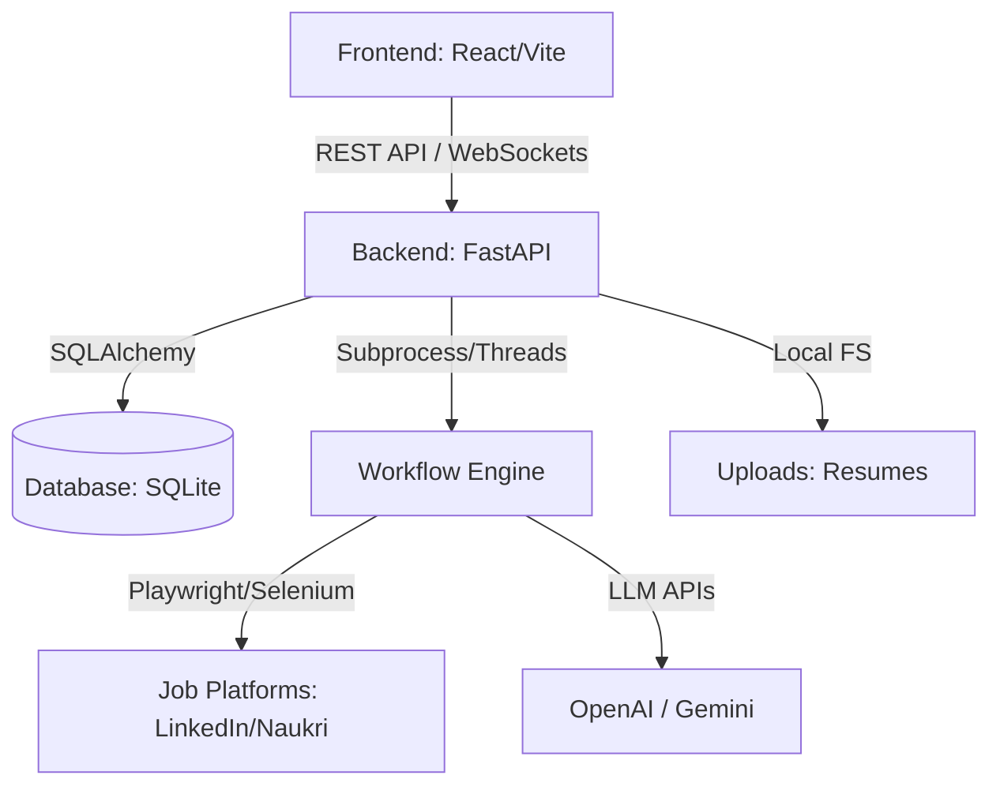

# 🤖 JOB_AGENT: Autonomous AI-Driven Job Application System

[](https://www.python.org/)
[](https://fastapi.tiangolo.com/)
[](https://react.dev/)
[](https://playwright.dev/)
[](https://github.com/langchain-ai/langgraph)
[](https://www.docker.com/)

**JOB_AGENT** is an advanced, production-grade autonomous agent system designed to automate the end-to-end job search and application process. It parses your resume, scrapes listings from LinkedIn and Naukri, matches and scores opportunities against your profile, optimizes your details for ATS compatibility, and automatically fills out application forms using a headless browser. All of this is monitored via a sleek, real-time dashboard.

---

## 🌟 Key Features

- **📄 Smart Resume Parsing**: Extracts skills, experience, and contact details from PDF resumes using LLM APIs.
- **🔍 Intelligent Job Discovery**: Scrapes job listings based on your target titles and keywords from major platforms (LinkedIn & Naukri).
- **🧠 Match Scoring**: Compares job descriptions against your parsed resume and user profile, returning a match score (0-100%).
- **⚡ ATS Resume & Letter Optimization**: Dynamically tailors resume snippets and cover letters to align with job requirements before applying.
- **🤖 Autonomous Form Submission**: Leverages Playwright to automate clicking, text entry, and file uploading during the application process. Includes standard check/loop/validation recovery mechanisms.
- **🖥️ Real-time Glassmorphic Dashboard**: A React-based web dashboard to manage credentials, upload resumes, compile workflows, monitor statuses, and view live logs.
- **🌐 NoVNC Virtual Browser Tab**: Watch the automated browser fill forms live right from your dashboard!
- **🔒 Persistent Browser Sessions**: Sessions (cookies, local storage) are stored securely under `browser_data/` so you only have to log in or solve OTPs/Captchas once.

---

## 📐 System Architecture

The following diagram illustrates the interaction between components:



---

## 📂 Project Structure

```text
JOB_AGENT/
├── agents/             # AI Agents (Resume Parser, Matcher, Decision, Deep Apply, Tracker)
├── db/                 # Database schema and CRUD helpers (SQLAlchemy)
├── docs/               # System documentation & connectivity maps
├── engine/             # Automation engine (Action Executor, Planner, Recovery, Smart Waiter)
├── frontend/           # React dashboard UI (Vite, React 19, Context API, CSS)
├── graph/              # LangGraph workflow definition and state management
├── server/             # FastAPI backend (Routes for Auth, Users, Workflow, Dashboard, Data)
├── tools/              # Playwright, scraper, DOM optimizer, and form parser scripts
├── uploads/            # Local folder for user-uploaded resumes
├── main.py             # CLI Entrypoint for running the workflow
├── docker-compose.yml  # Docker Compose orchestration
└── requirements.txt    # Python requirements
```

---

## 🔧 Installation & Setup (Local)

### 📋 Prerequisites
- **Python 3.10+**
- **Node.js 18+**
- **Docker** (Optional, for containerized run)

### 1. Clone & Configure Variables
Create a `.env` file in the root directory by copying the template:
```bash
cp .env.example .env
```
Fill in the values:
```env
# API Keys
OPENAI_API_KEY=your-openai-api-key
GEMINI_API_KEY=your-gemini-api-key

# JWT Configurations for auth
JWT_SECRET=your-random-jwt-secret

# Job Board Credentials
LINKEDIN_USER=your-linkedin-email
LINKEDIN_PASS=your-linkedin-password
NAUKRI_USER=your-naukri-username
NAUKRI_PASS=your-naukri-password
```

### 2. Setup Backend
Install requirements:
```bash
pip install -r requirements.txt
playwright install
```
Start the FastAPI server:
```bash
python server/app.py
```
The API will run at `http://localhost:8000`.

### 3. Setup Frontend
Navigate to the `frontend` folder, install dependencies, and start Vite:
```bash
cd frontend
npm install
npm run dev
```
Open `http://localhost:5173` in your browser.

---

## 🐋 Docker Compose Execution (Recommended)

To run the complete system (FastAPI backend + VNC server + React Frontend) inside containerized environments:

1. **Build and start services**:
   ```bash
   docker compose up --build -d
   ```
2. **Access Points**:
   - **Frontend Dashboard**: `http://localhost:8082`
   - **FastAPI API Server**: `http://localhost:8000`
   - **NoVNC Web Browser Stream**: `http://localhost:6080` (or embedded in dashboard)

---

## 🔒 Security & Git Notice

The repository has been configured with a root `.gitignore` to prevent:
- Committing sensitive API keys and personal credentials (`.env`).
- Committing local session cookies and browser history (`browser_data/`).
- Committing temporary runtime caches and large dependency bundles (`node_modules/`, `__pycache__/`).

**Do not remove these lines from `.gitignore` to prevent leaking your account details.**
