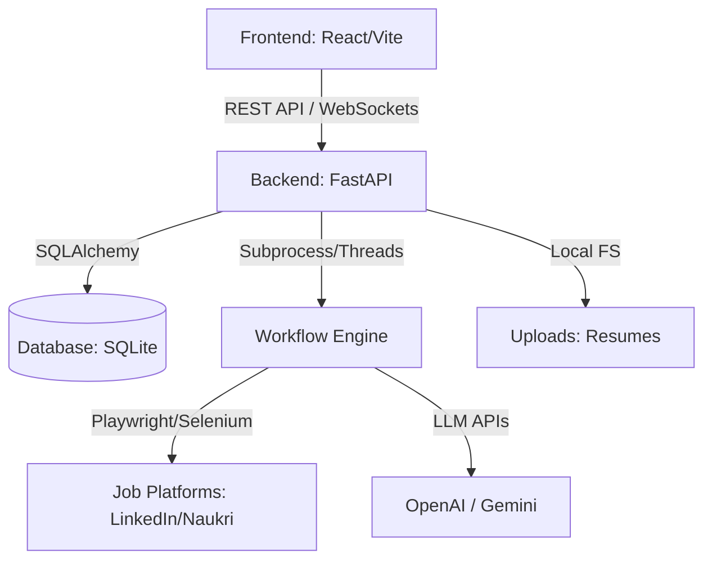

# JOB_AGENT System Design

## 1. Overview
JOB_AGENT is an autonomous AI-driven system designed to automate the end-to-end job application process. It scrapes job listings, parses resumes, matches jobs based on user profiles, and autonomously applies to jobs using a headless browser.

## 2. System Architecture

### 2.1 Component Diagram

## 3. Frontend Architecture
Built with **React 18** and **Vite**, the frontend provides a real-time dashboard for monitoring agent activities.

### 3.1 Technology Stack
- **Framework**: React.js (Functional Components, Hooks)
- **State Management**: React Context API (`AuthContext`)
- **Real-time Communication**: WebSockets (native `WebSocket` API)
- **Styling**: Vanilla CSS with Modern Glassmorphism & Fluid Animations
- **Build Tool**: Vite

### 3.2 Core Components
- `App.jsx`: Main entry point, handles routing and global WebSocket connection.
- `Dashboard.jsx`: Displays application stats and progress charts.
- `Workflow.jsx`: Interface to launch and stop the AI agent.
- `Logs.jsx`: Real-time terminal for agent execution logs.
- `Jobs.jsx` / `Applications.jsx`: Data tables for discovered jobs and application history.

## 4. Backend Architecture
Built with **FastAPI**, the backend handles authentication, data persistence, and workflow orchestration.

### 4.1 Technology Stack
- **Web Framework**: FastAPI (Asynchronous)
- **Server**: Uvicorn
- **ORM**: SQLAlchemy
- **Authentication**: JWT (JSON Web Tokens) with `OAuth2PasswordBearer`
- **Background Tasks**: Python `threading` and `asyncio`

### 4.2 Modular Routes
- `/api/auth`: Login, Signup, and Token refreshing.
- `/api/user`: Profile management and API key storage.
- `/api/workflow`: Launching and monitoring the AI pipeline.
- `/api/data`: CRUD operations for jobs, logs, and applications.
- `/api/dashboard`: Aggregated stats for the UI.

## 5. Frontend-Backend Connection Details

### 5.1 Authentication Flow
1. User submits credentials to `/api/auth/login`.
2. Backend validates against SQLite and returns a JWT.
3. Frontend stores the token in `localStorage`.
4. All subsequent requests include the token in the `Authorization: Bearer <token>` header.

### 5.2 API Endpoints Reference

| Method | Endpoint | Description |
| :--- | :--- | :--- |
| **GET** | `/api/workflow-status` | Returns current agent state (running, current step, progress). |
| **POST** | `/api/start-workflow` | Triggers the `WorkflowRunner` background thread. |
| **POST** | `/api/stop-workflow` | Signals the agent loop to terminate gracefully. |
| **POST** | `/api/upload-resume` | Handles multipart file upload to `/uploads/{user_id}/`. |
| **GET** | `/api/jobs` | Fetches jobs discovered during the scraping phase. |
| **GET** | `/api/applications` | Fetches history of submitted job applications. |
| **GET** | `/api/dashboard` | Returns summary statistics (Applied, Match %, Active Jobs). |
| **GET** | `/api/resumes` | Lists all uploaded PDF resumes for the user. |

### 5.3 WebSocket Protocol (`/ws`)
The WebSocket connection provides low-latency updates for the "Live Logs" and progress bars.

- **Connection**: Established on App load if authenticated.
- **Payload Format**: JSON
- **Events**:
  - `init`: Sends the last 50 logs and current status upon connection.
  - `log`: Real-time execution logs from the agent (e.g., "Navigating to LinkedIn...").
  - `status`: Periodic updates on workflow progress (0-100%) and current step.

## 6. Data Model (SQLite)

### 6.1 Users Table
- `id`: Primary Key
- `email`: User login email
- `hashed_password`: Securely stored password
- `name`: Full name
- `openai_api_key` / `gemini_api_key`: Encrypted API keys
- `preferred_model`: Default model (e.g., `gpt-4o`, `gemini-1.5-flash`)

### 6.2 Applications Table
- `id`: Primary Key
- `user_id`: Foreign Key to Users
- `job_id`: Unique identifier for the job
- `company`: Company name
- `title`: Job title
- `url`: Link to the job listing
- `match_score`: AI-calculated match percentage
- `decision`: AI decision (Apply/Skip)
- `status`: Result of application (Applied/Failed/Pending)
- `error`: Error message if application failed
- `created_at`: Timestamp of entry

## 7. Workflow Engine Flow
The `WorkflowRunner` follows a deterministic LangGraph-like sequence:
1. **Resume Parser**: Extracts skills and experience from PDF.
2. **Job Discovery**: Scrapes LinkedIn/Naukri based on user settings.
3. **Matcher**: Uses LLM to score jobs against the parsed resume.
4. **Decision Agent**: Filters jobs based on match score threshold.
5. **ATS Optimizer**: Tailors resume/answers for specific jobs.
6. **Deep Apply**: Navigates browser to fill forms and submit.

---
*Created on 2026-05-13 | Version 1.0*
